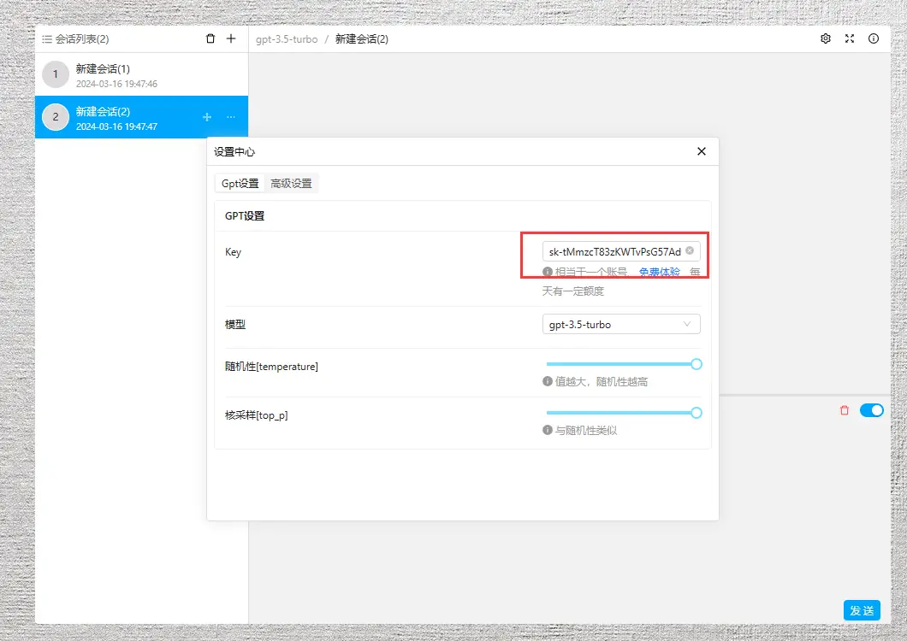

### 前言

这是什么？

```
这是一款开源CHAT-GPT WEB应用，使用vue3开发
原型参照了腾讯QQ，在操作细节上下足了功夫，确保用户的操作丝滑流畅
技术：VUE3+ANT-UI+TS

**	如果对产品有建议或者bug反馈
**	请发送邮件到4448981953@qq.com
**	任何提议都会得到反馈
```


#### 使用对话功能

先 <a href='https://faucet.openkey.cloud/'>获取KEY</a>，点击设置按钮，填入`KEY`中即可

每天有免费的额度，对个人来说已经完全够用了。

非特殊场景，可以关闭记忆功能，减少tokens消耗




#### 在线体验

<a href='https://gitee.com/in-git/chat-gpt.git'>立即前往</a>

#### 预览


